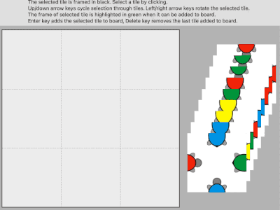

[//]: # "title: A German Dog Puzzle, Recursion and Backstepping"
[//]: # "slug: a-german-dog-puzzle-and-recursion"
[//]: # "pubDate: 4/12/2024 12:01"
[//]: # "lastModified: 4/12/2024 13:20"
[//]: # "excerpt: "
[//]: # "categories: programming"
[//]: # "isPublished: true"

At times, programming feels like something entirely different from building software within the boundaries of monetary expectations and some external pseudo-demands. The paper before you, filled with attempts at sketching algorithms, the allure of simply understanding structures, can be captivating - and yet, the frustrations can feel completely boundless. It can cripple your inability to step back, consult books, learn from the struggles of others, and try anew. To linger into the early hours of the morning, poring over details, branching out, circling back, starting over. What a fucking mess it can be.

When the children are asleep, conversations seem distant, and your mind swirls with possibilities - both the challenge at hand and the one waiting just beyond it - I find myself drifting more quickly to the window. I squeeze it open, letting the late evening's cool quietly embrace me, pulling me into a mental space filled with sweet digital memories and unresolved puzzles. 

Dogs still bark in the hills. The moon hangs large over the cypress lining the avenue, reminding me of my place within my own surroundings. I tell myself, "I must program this to learn." To confront my shortcomings. To be in conflict. To conquer. To feel the satisfaction - not in the solution itself, but in the unraveling of understanding something. The act of completing something feels good. To have created a result feels meaningful.

The heavy yellow light has returned. The Half-moon and half-streetlamp. My feel is half-knowing and half-powerless. The humble honesty of my poor self, the echo in the clatter of my keyboard, while Ferry Corsten's upbeat rhythms weave into my ears, carrying me into some mellow trance of presence and, ultimately, exhaustion. Another night like this.

I've always found recursion to be equal parts amusing and frustrating. When I first encountered it in 2001, it was in connection with a tree structure I was tasked with printing on a screen - something hierarchical. Perhaps it was something as labyrinthine and finite as an organizational diagram for a government office. Fucking thing wouldn't stop printing shit on the screen.

I swear here because I am actually tired. But I am alright. Tired though.

I remember it vividly. I spent hours agonizing over why my brain couldn't grasp why a simpler iterative loop wouldn't suffice. I couldn't solve it. I hadn't even heard of recursion before, and while it's technically possible to traverse a tree structure without a self-calling function, my mind couldn't comprehend how.

I couldn't even be partly in invention of the idea that a function could call itself to arrive at a final result. I am, what do you mean by calling yourself ? Are you fucking with me ? But after all, I didn't come from a computer science background - as a kid I programmed some C64, but I was also out a lot, looking for skateboarding spots. 

Being sunk into the leather chair, Lis Wessberg playing softly in the speakers, a glass of dark rum before me, I now open the dense references with joy, almost bliss, eager to sink myself into these topics. Not like the old days, when speed was necessary to survive a job, but now, it's for the sheer pleasure of understanding - slowly.

Because how does one calculate the "child" of a "child" of a "parent"? Equal parts art, craft, timing, and logical reasoning. Correctness is enough for me, I am not pedantic. Even after 25 years of programming, I know I'm not particularly skilled in the grand scheme of this. But I get around.

A tree structure. My goal back then was to produce a result like this:

```
Frontpage
    Articles
        Archive
        By Author
            Nuller
            Niller
        Latest
            Yesterday
                Morning
                Afternoon
                Night
About
Contact
    Secratary
    Leadership
```

And the data I had available was structured as follows:

```
key     child     title
 1      null    Frontpage
 2      null      About 
 3      null     Contact
 8       1       Articles
 11      8       Archive
 12      8       By Author
 13      12      Niller
 17      12      Nuller
``` 

And so on...[A good match for the use of recursion](https://sharplab.io/#v2:EYLgtghglgdgNAFxAJwK7wCYgNQB8ACATAIwCwAUPgAwAE+xALANwX4DMdhNAwjQN4UaQusQBsdBjQCy0GAAoAlP0HDVANwjIaGCAgg0AvDRgBTAO40AMlADOCADwAVZCZMBJBCbAA+FaqEC5P7BxuY0zq4eXvw0ANImAJ6GNMTEcDwAFlAANhjJABzpjlAI2SbJAEQAgsgAxllqJhU0AL5wfiFCphYR7p5gMfFJRmmZOXlGMKjZ2UUlZZUAYsgA9jAIAA4QAOZNre1BncLd4S590XxxicmE6dxZuclTM3Ol5UbVwCuoCM1tHZ0Tr0ogNLkNksQ2HcHhMUrdwvN3jQKgA5HJlZB/A5HY5hYH9QbXIxQsaPSbTWYIt6VbhrPS1X77AEhIFnEGE4Y0Qqk2GjYrUj41BBQWplGxY5nBVmRAlgolw6HjAqvBYfABCSSqPwyK0xTMOOOl51BV05xAA7IqyQqqarkSiKSY9f8Df4WixXapJTQAArIWAIXpyHR6BQe1QtDodejifCSP0BoPWOxONn9bw0EpeGzpAMAfhoWxc63B5JemfWNDKjWyySoCg6gU6ADNdSYIPUaHINFoswNYJn+jYG57hE2cZnm12+wA6e5KgxGIsmEuJEcT5SjnH0ACccgAJBU+Cd6FQ5AByGjn9LVky1gBUNAYChafpWtRMNhssG2g68IFNAw+FnIY2h5IDZ3nXIwP5MoIP6GdYJMFoKjDb1Ol3OQT2IM9L2vKsTBrGhH2fGhsBoQ8AFp+FnJCULQrcjnQkIAHoWJoFxalQZBvzWZjggTdYgz7HM/zAGchhvQi7zIlIGI3SNGMU71MMPY8wlPC9KPw28HxoQgXxoABRAAPEofw4kwuJ4qA1gA5dVwSICHIQUCpJrIDdPo8NhEUr1yGUygOCIU4ZS8ChxyEdgKwQU0Yl2BAmBoGwTES1pow4fMeXi1KkpStK/OEaLT1tcpLgSvLctaSoKg9FogA). 

```
Processing item: Key=1, Child=, Title=Frontpage
- Frontpage
    Processing item: Key=8, Child=1, Title=Articles
    - Articles
        Processing item: Key=11, Child=8, Title=Archive
        - Archive
------ Exiting recursion: parentKey=11, level=3
        Processing item: Key=12, Child=8, Title=By Author
        - By Author
            Processing item: Key=13, Child=12, Title=Niller
            - Niller
-------- Exiting recursion: parentKey=13, level=4
            Processing item: Key=17, Child=12, Title=Nuller
            - Nuller
-------- Exiting recursion: parentKey=17, level=4
------ Exiting recursion: parentKey=12, level=3
---- Exiting recursion: parentKey=8, level=2
-- Exiting recursion: parentKey=1, level=1
Processing item: Key=2, Child=, Title=About
- About
-- Exiting recursion: parentKey=2, level=1
Processing item: Key=3, Child=, Title=Contact
- Contact
-- Exiting recursion: parentKey=3, level=1
 Exiting recursion: parentKey=, level=0
```

Throughout my career, I have often encountered cases where similar data is modeled by adding yet another column, which at first glance seems to make things "easier" than resorting to recursion. A column where the tree is precomputed for each node. This opens up the possibility of traversing the tree linearly.

```
key     child     title		precomp
 1      null    Frontpage	  1
 2      null      About 	  2
 3      null     Contact	  3
 8       1       Articles	  1, 8
 11      8       Archive	  1, 8, 11
 12      8       By Author    1, 8, 12
 13      12      Niller		  1, 8, 12, 13
 17      12      Nuller		  1, 8, 12, 17
``` 

I suddenly remember the last time I used recursion was for an experience and solution I devised for the ["A Man with a Three Path Challenge."](https://danielfrost.dk/a-man-with-a-three-page-path-challenge.html) In that scenario, I ended up [using recursion to partition data.](https://github.com/Danielovich/LogParsingKata/blob/f089623039a699c33608429ffbb503af023ebb66/pathanalyzer/UserPathPartitions.cs#L40)

Yet, as if a wrench was suddenly thrown into the gears of my old OM636, I stumbled upon an article by [Mark Seemann about the delightful little game *Das Verflixte Hundespiel*.](https://blog.ploeh.dk/2024/10/03/das-verflixte-hunde-spiel/) And there I was - trapped. Let me clarify: it's not as if I don't understand which battles are worth fighting. But this challenge? It blindsided me. And it was a great read too. Bollocks.

### Das Verflixte Hundespiel

For hours each evening, over the course of a week, I found myself returning to this puzzle. A week when, by all measures, I had no energy to write a single line of code. And yet, there I sat. Paralyzed by the backtracking nature of a challenge I had convinced myself I must solve.

What makes this puzzle particularly challenging, in my opinion, isn't just the number of possible permutations. It's the combination mechanism (rotation), the potential need for memory to track which pieces have been tried and where, and - crucially - the twist recursion introduces: the requirement to "backtrack" to every prior execution.

The Haskell code I had in front of me offered little assistance - I simply don't read Haskell. But I understood the logical, come to understand difficult to solve, designed rules of the game.

My first attempt was, quite honestly, more about getting something to compile than it was about crafting a solution. I needed to grasp the mechanics: how a piece in the game, when it doesn't fit, forces you to backtrack to the previous position on the board, try a different combination, and continue this process until all possible paths lead to a positive outcome.

Very quickly, my implementation became ridiculously unwieldy and obscure. I realized I had gone too far. The solution didn't need to be this convoluted. As always when I program, I start over at least some times.

Here's an excerpt from that first iteration:


```
public bool Solve(PuzzleSetup setup, PuzzleGridRowColumn topRow, int column)
{
    // we are at the first tile, we must start from the beginning
    if (column == 0)
    {
        setup.ReleaseUnvailableTile(topRow.PuzzleRow[0]);
        var mostLeftTile = setup.PickAnyTilePseudoRandom();
        topRow.PlaceTileInColumn(mostLeftTile, 0);
        setup.AddUnvailableTile(mostLeftTile);

        //since we might get in here by stepping back, we release
        setup.ReleaseTriedTiles();

        ++column;
    }

    foreach (var item in setup.AvailableTiles.ToList())
    {
        // if we have reached index 3 we are out of bounds and know we have succeeded
        if (column == 3)
            return true;

        var tryTile = setup.PickAnyTilePseudoRandom();
        var tryTileRotations = setup.Rotations(tryTile);

        //remember the tile that did not work so it's not being tried again.
        //and then release it when we find a match.
        var tileMatch = topRow.IfLeftTileMatchRightTilePlaceTile(topRow, column, tryTileRotations);

        // no match
        if (!tileMatch)
        {
            // if we have exhausted available tiles, release, step back and retry on that column index
            if (setup.AvailableTiles.Count == 0)
            {
                setup.ReleaseTriedTiles();

                // step back
                if (column > 0)
                {
                    --column;
                }
            }

            Solve(setup, topRow, column);
        }
        else
        {
            //match, make the tile unvailable
            setup.AddUnvailableTile(tryTile);

            //next column
            ++column;
        }
    }

    return false;
}
```

And so, I had at least four or five iterations that ended up looking rather peculiar.  

[Ken Shirriff explains the challenge greatly on his blog about this very puzzle.](https://www.righto.com/2010/12/solving-edge-match-puzzles-with-arc-and.html) I also delved into some of [Stanford's CS106b material](https://web.stanford.edu/class/archive/cs/cs106b/cs106b.1236/assignments/4-backtracking/tilematch), which featured a visualization of the solution - a striking depiction of where the combinations are tested and how the algorithm backsteps. Let me just say, the material available on Stanford's computer science pages is absolutely phenomenal.  



In the meantime, as I explored what turned out to be an incredibly elegant algorithm, I managed to solve a few smaller challenges. I failed miserably at using TDD though - a method I almost can't code without - and it's been ages since that last happened. I think the issue was that I didn't have a clear enough picture of how I wanted this to look in the end. As I mentioned to myself earlier, my coding stamina was far from strong that week. I was mentally elsewhere for most of it, and when my focus is scattered, I can't produce anything meaningful.

```
public class PuzzleSolver
{
    private const int gridSize = 9;
    private bool[] usedTiles;

    public PuzzleTile[,] PuzzleBoard;
    public PuzzleTile[] Tiles { get; set; }

    public PuzzleSolver(PuzzleTile[] puzzleTiles)
    {
        Tiles = puzzleTiles;
        PuzzleBoard = new PuzzleTile[3, 3];
        usedTiles = new bool[9];
    }

    public bool Solve()
    {
        ResetBoard();

        return PlaceTile(0, 0);
    }

    private void ResetBoard()
    {
        // no Array.Fill for [,]
        for (int row = 0; row < 3; row++)
            for (int col = 0; col < 3; col++)
                PuzzleBoard[row, col] = PuzzleTile.Empty;


        Array.Fill(usedTiles, false);
    }


    private int executionCounter = 0;
    private int NextExecution()
    {
        return executionCounter++;
    }

    private int NextRow(int column, int row)
    {
        return column == 2 ? row + 1 : row;
    }

    private int NextColumn(int column)
    {
        return (column + 1) % 3; //3 is max column size
    }

    private bool PlaceTile(int row, int column)
    {
        //...
    }


    private bool IsPlacementValid(PuzzleTile tile, int row, int col)
    {
        // Check top
        if (row > 0 && PuzzleBoard[row - 1, col] != null)
        {
            if (!TileMatches.TopBottomMatch(PuzzleBoard[row - 1, col], tile))
                return false;
        }

        // Check left
        if (col > 0 && PuzzleBoard[row, col - 1] != null)
        {
            if (!TileMatches.LeftRightMatch(PuzzleBoard[row, col - 1], tile))
                return false;
        }

        return true;
    }
}

public static class TileRotator
{
    public static PuzzleTile Rotate(PuzzleTile incoming)
    {
        return new PuzzleTile(incoming.left, incoming.top, incoming.right, incoming.bottom);
    }

    public static IEnumerable<PuzzleTile> Rotations(PuzzleTile current)
    {
        var rotations = new List<PuzzleTile>();

        for (int i = 0; i < 4; i++)
        {
            rotations.Add(current);
            current = Rotate(current);
        }

        return rotations;
    }
}

public static class TileMatches
{
    public static readonly HashSet<string> matches;

    static TileMatches()
    {
        matches = new HashSet<string>
        {
            "BHBT",
            "GHGT",
            "SHST",
            "UHUT"
        };
    }

    public static bool LeftRightMatch(PuzzleTile left, PuzzleTile right)
        => matches.Contains(string.Concat(left.right, right.left));

    public static bool TopBottomMatch(PuzzleTile top, PuzzleTile bottom)
        => matches.Contains(string.Concat(top.bottom, bottom.top));
}

public static class TileShuffler
{
    public static PuzzleTile[] Shuffle(List<PuzzleTile> array)
    {
        return array.OrderBy(_ => Guid.NewGuid()).ToArray();
    }
}

public record PuzzleTile(string top, string right, string bottom, string left)
{
    public static PuzzleTile Empty => new PuzzleTile(string.Empty, string.Empty, string.Empty, string.Empty);

    public override string ToString()
    {
        return $"Top: {top} Right: {right} Bottom: {bottom} Left: {left}";
    }
}
```

And so, I emerged from that week, not with a pristine solution, but with a deeper understanding of the problem - and myself. It reminded me of why I code in the first place. It's not about the cleanest implementation or even solving the puzzle; it's about the process - the way challenges stretch the mind and reveal its limits, the quiet joy of inching closer to clarity, even through failure.

Sometimes, the real value isn't in finding the perfect answer but in the effort and persistence it takes to get there. The week left me with a respect for the elegance of recursion, the complexity of backtracking, and the satisfaction of tackling something that genuinely stretched my limits.

I am not serving you pleasure of the final solution, simply because if that's what you came for, you are too lazy. I will though be deligthed to leave you a blueprint.

```
private bool PlaceTile(int row, int column)
{
    if (row == 3) // base case, solved!
    {
        return true;
    }
    
    int nextRow = NextRow(column, row);
    int nextColumn = NextColumn(column);
    
    for (int i = 0; i < Tiles.Length; i++)
    {
        if (usedTiles[i])
        {
            continue;
        }
        
        foreach (var rotatedTile in TileRotator.Rotations(Tiles[i]))
        {
            if (IsPlacementValid(rotatedTile, row, column))
            {
                //your turn...
            }
        }
    }
    return false;
}
```